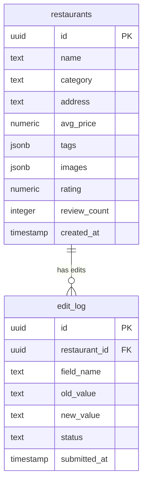

# xiaozhong-dianping 架构设计

沈阳美食推荐平台，已上线运营。群友共建的小众版大众点评。

本仓库公开项目的**全栈架构、安全设计和运维经验**，不包含可运行源码。

---

## 系统架构

```mermaid
graph TD
    A[用户浏览器] --> B[Cloudflare Pages<br>Astro SSR/Static]
    B --> C[/api/supabase 代理]
    C --> D[Supabase PostgreSQL]
    B --> E[/api/upload]
    E --> F[Cloudflare R2<br>图片存储]
    B --> G[/api/admin 鉴权]
    G --> D
    
    H[GitHub Actions] -->|push 触发| B
    I[管理后台] --> G
```

## 核心设计决策

### 1. 为什么选 Astro + Supabase + Cloudflare Pages

**约束条件**：
- 零成本运营（学生项目，无预算）
- 需要真实用户访问（不是 demo）
- 需要图片存储（餐厅照片）
- 需要数据库（餐厅信息、评价、用户提交）
- 一个人维护（全栈复杂度必须低）

**选型对比**：

| 方案 | 前端 | 后端 | 数据库 | 图片 | 月成本 | 决策 |
|------|------|------|--------|------|--------|------|
| ✅ 最终方案 | Astro (CF Pages) | CF Pages Functions | Supabase Free | R2 Free | ¥0 | 全免费额度内 |
| 备选A | Next.js (Vercel) | Vercel Serverless | PlanetScale | Vercel Blob | ¥0 | PlanetScale 免费额度取消 |
| 备选B | Vue + Nginx | 自建 VPS | MySQL | 本地 | ~¥50/月 | 学生无预算 |

**Astro 的优势**：默认零 JS 输出（Islands Architecture），首屏加载极快；需要交互的组件（编辑弹窗、评分）才 hydrate React 组件。对内容型站点（餐厅列表）是最优解。

### 2. 安全模型：三层防护

**问题**：早期版本把 Supabase anon key 硬编码在前端页面里，任何人 F12 就能拿到 key 直接操作数据库。

**修复后的三层架构**：

```
第1层：Cloudflare Pages Functions（服务端代理）
  - 前端不直连 Supabase，所有请求走 /api/supabase/[...path] 代理
  - 代理层注入 service_role key（存在 CF 环境变量，不入代码）
  - 前端只知道同域 /api/supabase，不知道 Supabase 地址

第2层：Supabase RLS（行级安全策略）
  - 即使拿到 anon key，RLS 限制只能 SELECT 公开数据
  - INSERT/UPDATE/DELETE 需要 service_role（只在服务端）

第3层：Admin 鉴权（管理操作）
  - /api/admin/[...path] 需要密码验证
  - 密码存 CF Secret（`wrangler secret put`），不入代码
  - 密码轮换后旧密码立即失效
```

**设计原则**：前端代码中不出现任何 Supabase 地址或 Key，所有数据库操作经服务端代理层转发，密钥仅存在于 CF 环境变量中。

### 3. 图片存储：R2 + CDN

**方案**：Cloudflare R2（S3 兼容对象存储）+ R2.dev 公开访问域名。

**上传流程**：
```
用户选择图片 → 前端压缩（canvas resize）→ POST /api/upload
→ CF Function 校验（类型/大小）→ 写入 R2 → 返回 R2.dev URL
→ 前端把 URL 存入 Supabase 餐厅记录
```

**约束**：
- 单张 ≤ 5MB（CF Pages Functions 请求体限制）
- 只接受 image/jpeg, image/png, image/webp
- 文件名用 hash（避免中文路径问题）
- R2 Free 额度：10GB 存储 + 100 万次读/月（当前用量远未触及）

### 4. 用户提交审核制

**问题**：开放编辑 → 垃圾信息/恶意修改；不开放 → 数据更新全靠我一个人。

**方案**：人人可提交修改，但需要审核才生效。

```
用户点击"编辑" → 填写修改内容 → POST /api/edit-restaurant
→ 写入 edit_log 表（status=pending）
→ 管理后台审核 → approve: 合并到主表 / reject: 标记拒绝
```

**edit_log 表结构**：
- restaurant_id, field_name, old_value, new_value
- submitted_at, status (pending/approved/rejected)

### 5. 部署流水线

```
git push → GitHub Actions → npm ci + astro build
→ wrangler pages deploy → Cloudflare Pages 全球 CDN
```

**CI 包含**：
- TypeScript 类型检查（`tsc --noEmit`）
- 密钥扫描（`scripts/scan-secrets.sh`）
- 构建产物大小检查（>5MB 警告）

**踩坑**：`scan-secrets.sh` 最初把文档里的说明性文字（如 "service_role key"）和 `.env.example` 占位值误判为密钥，CI 一直红。修复：只对匹配真实密钥格式（`eyJ...`、`sk-...`）的字符串报警，忽略文档和示例文件。

---

## 数据模型



---

## 运维经验

| 事件 | 原因 | 处理 |
|------|------|------|
| Supabase 连接间歇性失败 | Free 计划连接池限制（60 连接） | 加 CF Function 层做连接复用 |
| 图片加载慢 | R2.dev 域名无 CDN 缓存 | 改为通过 CF Pages 代理（自动 CDN） |
| 构建后页面空白 | Astro SSR 模式下 `import.meta.env` 为 undefined | 改为运行时从 CF 环境变量读取 |
| 密码泄露风险 | 早期硬编码在前端 | 轮换密码 + 迁移到 CF Secret + 清理 git 历史 |

---

## 已知限制

- Supabase Free 计划：500MB 数据库 + 1GB 文件存储 + 50K 月活
- 无用户认证系统（匿名提交，无法追踪恶意行为）
- 图片无 CDN 回源策略（R2.dev 直链，无法自定义缓存头）
- 单管理员审核，无多角色权限
